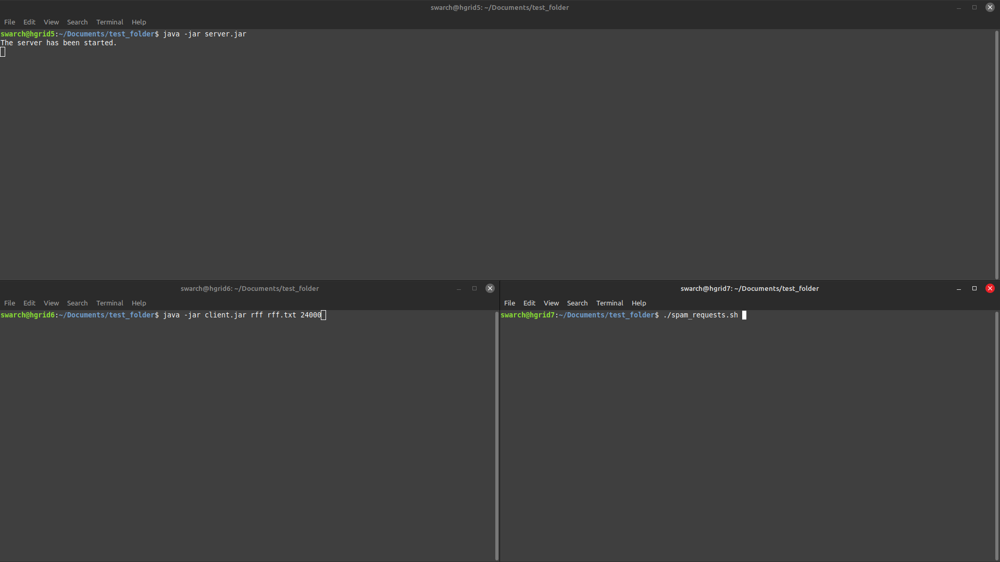

A continuación se presenta un reporte con respecto al timeout del *hello-world*:

## Metodología.
Se desplegó un servidor y dos clientes en los computadores del LIASON de la universidad ICESI.

- El servidor se ejecutó varias veces con el parámetro 'Ice.ThreadPool.Server.SizeMax' asignado a distintos valores, de tal forma que la cantidad de hilos empleados fuese distinta.

- Uno de los computadores ejecutaba el cliente y mandaba 24000 solicitudes para calcular el factor primo de 9223372036854775807 (Long.MAX_VALUE).

- El otro computador ejecutó el script 'spam_requests.sh' que crea N instancias del cliente. Cada una de estas también mandó 24000 solicitudes para calcular el factor primo de 9223372036854775807 (Long.MAX_VALUE).

- Estos dos procesos se hicieron al mismo tiempo, anotando la cantidad de clientes requeridos para que se hiciese timeout.

**Figura 1. El setup empleado para el proceso.**

**Figura 2. Script de bash empleado para el proceso.**

## Resultados:

**Figura 3. Timeout con 6 clientes y un solo hilo.**

**Figura 4. Timeout con 8 clientes y dos hilos.**

**Figura 5. Timeout con 10 clientes y tres hilos.**

**Figura 6. Timeout con 10 clientes y cuatro hilos.**

**Figura 7. Timeout con 10 clientes y cinco hilos.**

## Conclusiones.

Se puede deducir que a partir de tres hilos se tiene una concurrencia virtual puesto a que tiene el mismo rendimiento que con cuatro y cinco hilos (la cantidad de clientes sin timeout no cambia y tampoco hay una mejora en la latencia de cada solicitud).